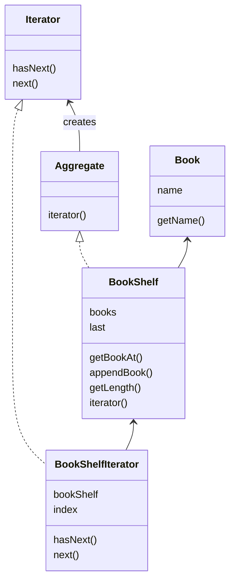

迭代器模式  
Iterator模式用于在数据集合中按照顺序遍历集合。

| 名字               | 说明          |
|-------------------|-------------|
| Aggregate         | 表示集合的接口 |
| Iterator          | 遍历集合的接口 |
| Book              | 表示书的类    |
| BookShelf         | 表示书架的类   |
| BookShelfIterator | 遍历书架的类      |
| Main              | 测试程序行为的类    |

